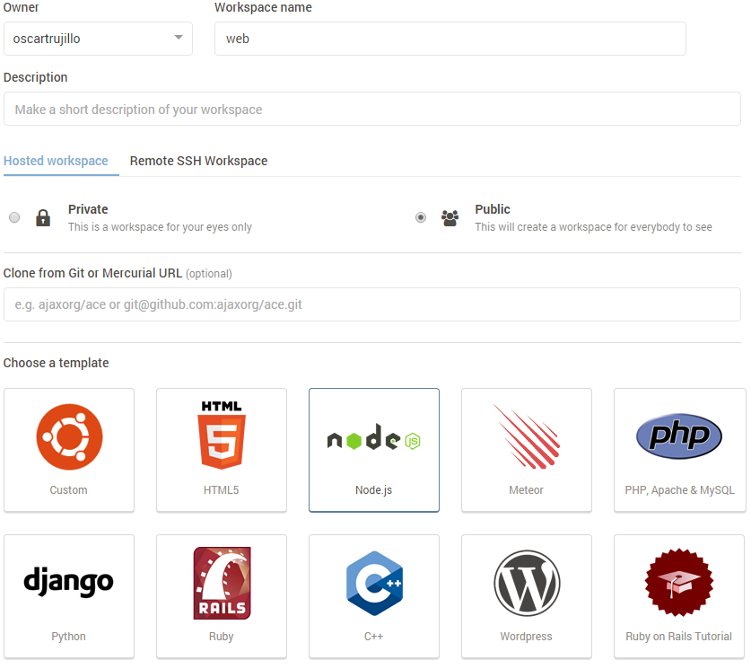
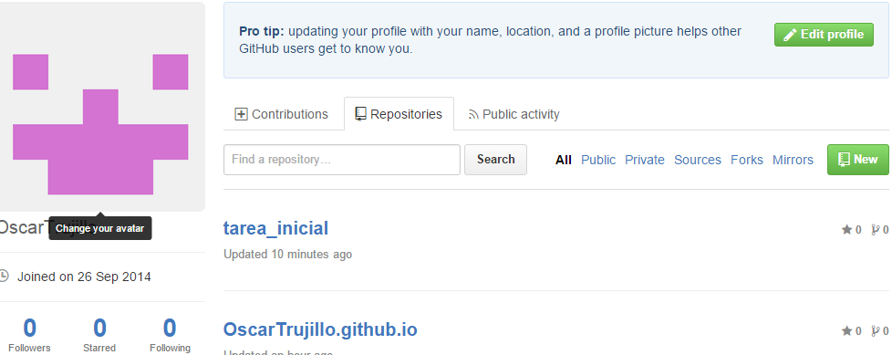
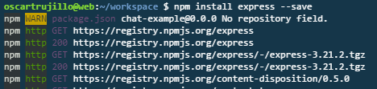
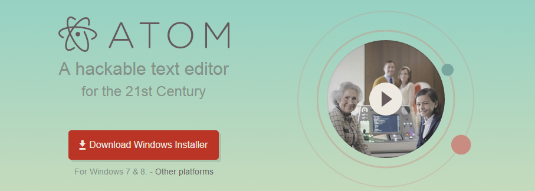

# Sistemas y Tecnologías Web

## Tutorial tarea Inicial:

En el siguiente documento se muestran los pasos que he seguido para completar los requerimientos de la tarea inicial de la asignatura.

1. C9.io

  Lo primero que he hecho ha sido crear un espacio de trabajo en C9.io.

2. node.JS

  El sistema de C9.io permite que cuando creas un nuevo espacio de trabajo le asignes un template determinado. en nuestro caso nos viene genial porque uno de los que nos ofrece es el de node.js. Con esto construimos un espacio de trabajo que ya nos ofrece este servicio sin necesidad de descargas posteriores.

    
3. GitHub

    He creado en mi cuenta GitHub dos repositorios. En uno tendré todas las ventajas que nos da gh-pages y en otro simplemente dispondré de esta tarea inicial.

    

4. Express

    He procedido a la instalación de Express en mi entorno de trabajo de cloud9:

    

5. Atom

    En cuanto al editor Atom lo he descargado para mi equipo Windows para no sobrecargar el Cloud9. Se descarga de manera muy facil desde su [página](https://atom.io/ "página").

    

6. MarkDown

    He utilizado formato MarkDown para escribir este tutorial. Me ha parecido un fromato muy muy simple y útil. Para aprenderlo me ha sido de utilidad este [blog](http://joedicastro.com/pages/markdown.html#mark3 "página") que proporciona información muy útil.

7. Pandoc

    Pandoc es un herramienta que nos permite traducir archivos en formato MarkDown. Para ello simplemente usamos el comando:

        pandoc -s -o pagina.html fichero.md

    Con esto nos creará un fichero llamado pagina.tml.

###### Óscar Trujillo Acosta
###### 23/09/15
    
